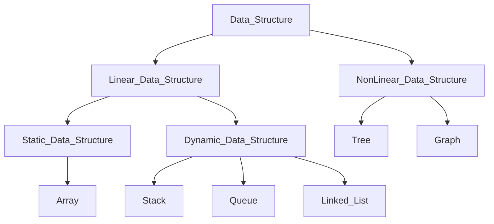

# Data Structure
Data Structure is way of processing, retriving, storing and organizing data. Its a way of arranging data on computer so that it can be accessed and updated efficiently.

## Classification of Data Stucture
- Linear Data Structure
- Non Linear Data Structure

 Diagram of Classification of Data Structure 

### Linear Data Structure

In linear data structure, data elements are arranged sequentially and linked to previous and next elements. Therefore, structure can be traversed in a single run. It represents one dimensional data structure. Eg. Array, Stack, Queue, Linked List. Implementation of this data structure is easy in computer's memory as elements are arranged sequentially. There is poor utilization of computer memory if a data structure storing data linearly is implemented.  With increase in the size of the data structure, the time complexity of structure increases.

There are 2 types of Linear Data Structure.
- Static Data Structure
- Dynamic Data Structure

#### Static Data Structure
Data structure that are of fixed size are called as Static Data Structure. Memory is allocated at the compiler time for static data structures and user cannot change their size after being compiled but, we can change the data which is stored in them. 
The fixed size provides many benefits as well as a lot of drawbacks to static data structures. With the fixed memory allocation there is no need to worry about the overflow and underflow while inserting or deleting the element in/from the static data structures but it consumes a lot of memory and is not space-efficient. There is memory wastage if less number of elements are alloted.
As the memory is provided at the compile time for static data structures all the memory allocated is contiguous so there is no need to worry about the memory address of all the elements, user only needs to store the address of the first element and other element’s location can be easily found.
It is less efficient and easier to code.
Eg. Array

#### Dynamic Data Structure
Data structures that are of the dynamic size are called dynamic data structures. Memory is allocated at the run time for dynamic data structure and the size of the dynamic data structures varies at the run-time of the code. Also, both the size and the elements stored in the dynamic data structure can be changed at the run time of the code.
The dynamic size provides many benefits as well as a lot of drawbacks of dynamic data structures. With the dynamic memory allocation, there is no memory loss occurs and we can allocate space equal to the required number of elements and memory can be reused. Users must have to check and carefully insert or delete data in/from the dynamic data structure to be safe from overflow and underflow conditions.
As the memory allocated at the run time for the dynamic data structures makes allocated memory non-contiguous which decreases the performance of dynamic data structures because we have to create another variable to store the address of their allocated memory.
It is more efficient and difficult to code.
Eg. Linked List, Stack, Queue

### Non Linear Data Structure
It is a data structure where elements are not placed in a sequntial or linear manner. In other words, A data elements of the non linear data structure could be connected to more than one elements to reflect a special relationship among them. 
In non linear data structure, elements can not be traverse in a single run. This structure represents multi-dimensional data structures.  Non-linear data structures have more complex implementation for efficient memory utilization.
Eg. Tree and Graph

## Application of Data Structure
- Operating System
- Graphics
- Image Processing
- Computer Design
- Blockchain
- Simulations
- Genetics

# Array
An array is a collection of items of same type stored in a contiguous memory locations. This makes easier to calculate the position of each element by simply adding an offset to a base value. Arrays represent multiple data elements of the same type using a single name. Accessing or searching an element in an array is easy by using the index number. An array can be traversed easily just by incrementing the index by 1. Arrays allocate memory in contiguous memory locations for all its data elements.

 

This is a type of static linear data structure. Each element in array is uniquely identified by their array index.

### One dimensional Array

 

### Multi Dimensional Array

## Operations that can be performed on Array
 - Creation
 - Traverse
 - Insertion
 - Deletion
 - Upadate
 - Search
 - Merge
 - Split Data
 - Order Statistic

### Differnet operations performed on array in Python is as follow:
[**Intoduction to Array using Python**](1_array_introduction.ipynb)

# Time Compelxity of Array

| Action  | Worst Case | Average Case  | Best Case |
| :--------------------: | :-------------: | :-------------: | :-------------: |
| Accessing Element  | O(1)  | O(1)  | O(1)  |
| Updating Element  | O(1)  | O(1)  | O(1)  |
| Inserting Element  | O(n)  | O(n)  | O(1)  |
| Searching Element  | O(n)  | O(n)  | O(1)  |
| Deleting Element  | O(n)  | O(n)  | O(1)  |

# Space Complexity of Array

Worst Case : **O(n)**

# Programs
    
## Array Rotation Programs

[1. Simple array rotation using temporary array.](arr_rotation/array_rotation_1.ipynb)
